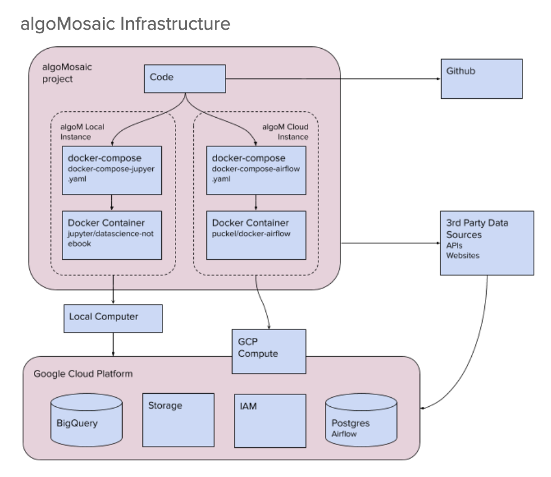

# Infrastructure

### Overview

The algoM framework acts as a middle layer between a set of 3rd party services:

- __Google BigQuery.__ BigQuery stores actions (e.g. training, prediction) metadata
    and analytical data used in algoMosaic. The `dataObject()` in `algom.data_object` allows
    users to import and query data to BigQuery.

- __Google Storage.__ Storage stores serialized models for future use. The `storageObject()`
    class in `algom.storage_object` allows users to store data to Google Storage easily.

- __Google IAM.__ IAM manages users access to various GCP systems. Adding a Service Account
    key provides access to GCP locally and in the cloud.  

- __Docker.__ We use two Docker images to containerize algoMosaic sessions. One is used for
    local processes and the other for scheduling processes in the cloud.

- __Apache Airflow.__ We use Airflow for workflow scheduling. __NOTE__ we are in the process
    of deprecating Airflow.

- __Tableau.__ Tableau is used for visualization of metadata from algoMosaic's processes or
    the analytical data algoMosaic uses. 

  

Here is a high level diagram of algoMosaic's infrastructure.

#### Current Infrastructure

#### Future Infrastructure

  

## Infrastructure

### Google Cloud Platform

algoMosaic sits on Google Cloud Platform (GCP) and leverages several of its services. 
Below is an overview of the services algoMosaic uses.

#### [Google BigQuery](https://console.cloud.google.com/bigquery)

We use [BigQuery](https://cloud.google.com/bigquery) to store the following types of data:

+ __algoMosaic metadata__. agloM stores data about the processes that are run on the platform.
    For instance, metadata is stored every time a model is trained, stored, and used for
    prediction.

+ __Analytical data__. Using `dataObject()`, users can import and query any data they wish.
    For instance, feature datasets are stored in BigQuery.

These are the default tables produced by algoMosaic:
+ `{project-id}.model_metadata.model_metadata_YYYYMMDD`
+ `{project-id}.model_metadata.model_parameters_YYYYMMDD`
+ `{project-id}.model_metadata.model_queries_YYYYMMDD`
+ `{project-id}.model_performance.model_backtest_YYYYMMDD`
+ `{project-id}.model_performance.model_backtest_metadata_YYYYMMDD`
+ `{project-id}.model_performance.model_backtest_summary_YYYYMMDD`
+ `{project-id}.model_performance.model_performance_YYYYMMDD`
+ `{project-id}.model_feature_importance.feature_importance_{ticker}_YYYYMMDD`

###### Source Code
+ `algom.utils.client.py`
+ `algom.utils.data_object.py`
+ `algom.configs.py`

TODO: ensure the datasets above are accurate. 

#### [Google Storage](https://console.cloud.google.com/storage/browser)

Google Storage is Google's [Cloud Storage Infrastructure](https://cloud.google.com/storage). 
We use it to store the models algoM produces and stores an a pickle file. 

The algoM framework natively produces the folder: `{domain}/models/`.

###### Source Code
+ `algom.utils.client.py`
+ `algom.utils.storage_object.py`
+ `algom.configs.py`

#### [Google IAM & Service Accounts](https://console.cloud.google.com/iam-admin/serviceaccounts?project=algomosaic-nyc)

In order to run BigQuery using `src.data_mgmt.bigquery_data`, you must create a Google Service 
Account. See [here](https://cloud.google.com/bigquery/docs/authentication/service-account-file) 
for instructions. Once the Service Account has been created, you will be prompted to upload the 
JSON onto your machine and specify the key path. 

###### Source Code
+ `algom.utils.client.py`

 

### Docker

algoMosaic uses Docker to containerize sessions. We use two Docker images:

+ [jupyter/datascience-notebook](https://hub.docker.com/r/jupyter/datascience-notebook/). We
    use this instance to run ad hoc analysis or execute processes from the CLI. This is used
    to run processes locally. 

+ [puckel/docker-airflow](https://hub.docker.com/r/puckel/docker-airflow/dockerfile/). We use
    this instance to run processes on a scheduled basis. __NOTE:__ we are in the process of
    deprecating Airflow in favor of Serverless.

###### Source Code
+ `docker-compose.yaml`
+ `docker-compose-airflow.yaml`
+ `docker-compose-jupyer.yaml`
+ `docker-airflow/*`
+ `docker-jupyter-notebook/*`
+ `docker-jupyter-ml-flow/*`
+ `docker-jupyter-postgres/*`

 

### [Airflow](https://airflow.apache.org/)

We have used Apache Airflow for 
[workflow scheduling and management](https://en.wikipedia.org/wiki/Apache_Airflow). 
However, we still need to create helper functions that connect between Airflow and the algoM 
framework.

##### WARNING!
We are in the process of deprecating Airflow in favor of Serverless.com.

###### Source Code
+ `docker-compose-airflow.yaml`
+ `docker-airflow/*`
+ `docker-jupyter-ml-flow/*`
+ `docker-jupyter-postgres/*`

 

### Tableau: data visualization

algoM uses Tableau for data visualization. We visualize:
+ Analytical data
+ Metadata from algoM processes (e.g. model metadata and performance summaries)
+ Results from algoM processes (e.g. model predictions)

  

### [Scikit Learn](https://scikit-learn.org/stable)

algoM's modeling class supports Scikit-Learn. Each model 
execution is serialized using a `model_execution_id` and 
`model_execution_id`.

Modeling classes include:
+ `algom.model_regression.modelRegression()`
+ `algom.model_clustering.modelClustering()`

###### Source Code
+ `algom.feature_importance`
+ `algom.model_clustering`
+ `algom.model_metadata`
+ `algom.model_plots`
+ `algom.model_regression`

 

### [Talib: financial indicators](https://github.com/gordonsilvera/algom-trading/blob/master/src/etl/talib.py)

We've build a financial indicators module based on 
[Quantopian's blog post](https://www.quantopian.com/posts/technical-analysis-indicators-without-talib-code), which has been refactored for Python3. 

For more information on the selection of financial indicators, 
see [here](https://docs.google.com/spreadsheets/d/1lyBSCZz6JidprUJ-rn2ddnMDwSpp52RkQWN_GAvVflI/edit#gid=0). 

  

## Resources

+ [Real Python: Documentation Guide](https://realpython.com/documenting-python-code/#docstrings-background)
+ [PEP8 Formatting Guidelines](https://realpython.com/python-pep8/)
+ [readthedocs.org](https://readthedocs.org/)
